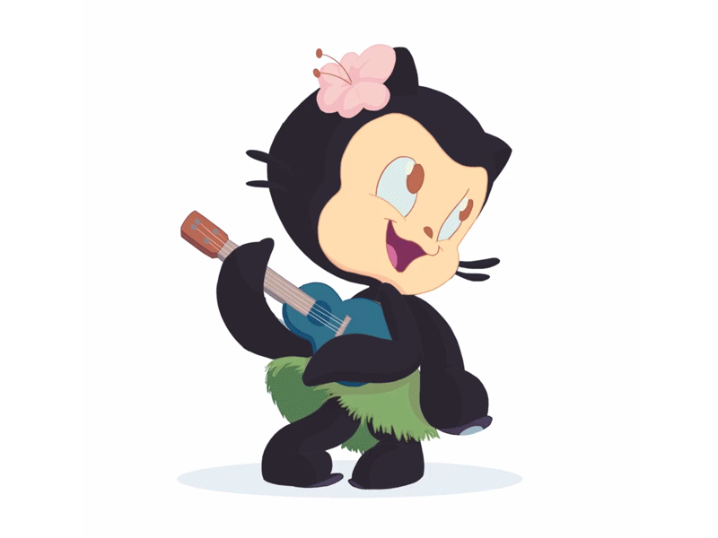

# Gurpreet Singh: Human being from 1990's 

*Technical Solution Architect || Mentor || Aspired to be TEDx Speaker || Food, Travel and System Design is Love*

#### *"I think, fundamentally, open source does tend to be more stable software. It's the right way to do things." — Linus Torvalds*

            
---

## Portfolio

- Architecting and Designing Products/ Systems.
- Doing Code reviews/ Process reviews/ Spec review/ setting up processes and managing projects.
- Exposure across multiple domains like Manufacturing, Security, Travel and Retail, eCommerce.
- Being able to get away easily at any level in the organization, feel confident in dealing with situations at hand and can turn around things that are ‘worst’ to ‘best’.
- Ambitious, highly motivated and able to face challenging work and deliver quality output while meeting deadlines.
- Results-oriented, Technology professional with proven leadership ability; capable of keeping a team focused on day-to-day tasks and long-term deadlines.

<h2>🚀 Few Tools/ Technologies/ Framework i use/used</h2>

---

## 🧐 Facts

- 🔭 I’m currently working on React, DevOps & Cloud 
- 🌱 I’m currently learning React,Nodejs,GO 
- 👯 I’m not looking to collaborate on anything rightnow BUT if you have something moderately difficult and interesting let me know. I can prioritize things. 
- 💬 Ask me about Anything in this world 
- 📫 How to reach me: [Whatsapp](https://wa.me/918589898914)  || [Email](mailto:gurpreet.singh_89@outlook.com)
- 😄 Pronouns: Demonstrative 
- ⚡ Fun fact: Google rents out goats!! 

## 💻 Statistics

&nbsp;

---
 <em><b>I love connecting with different people</b> so if you want to say <b>hi, I'll be happy to meet you more!</b> :)</em>

