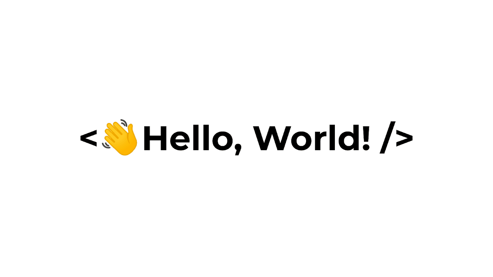

<div align="center">


[](https://git.io/typing-svg)

[](https://www.linkedin.com/in/gurpreettsengh/)
[](https://medium.com/@gurpreet.singh_89)
[](mailto:senghgurpreett@gmail.com)
[](https://github.com/supersaiyane/)


</div>

---

## About Me


```python
class Gurpreet:

    def __init__(self):
        self.role = "Senior Staff SRE @ NatWest Group"
        self.cloud = ["AWS", "Azure", "GCP"]
        self.languages = ["Python", "Go", "JavaScript", "TypeScript"]
        self.architecture = ["Distributed Systems", "Microservices",
                             "Event-Driven", "Cloud Native"]
        self.motto = "Build it resilient, or don't build it at all."

    def current_mission(self):
        return {
            "crafting":  "Fault-tolerant platforms at banking scale",
            "observing": "Everything — if it moves, I measure it",
            "scaling":   "Systems that millions depend on daily",
            "sharing":   "Knowledge through open source & Medium",
        }

    def beyond_the_terminal(self):
        return ["Cooking incredible meals 🍳",
                "Chasing the next vacation 🌍",
                "Deep-diving into emerging tech 🔭",
                "Collaborating on your next big idea 💬"]

    def philosophy(self):
        return ("I write code that doesn't just work — "
                "it scales, self-heals, and lets people "
                "sleep at night. ☁️")
```

<br clear="right"/>

---

## Tech Stack

<div align="center">

### Cloud & Infrastructure


### Observability & Monitoring


### CI/CD & Automation


### Languages & Frameworks


### Data & Messaging


</div>

---

## GitHub Analytics

<div align="center">
  
</div>

<div align="center">
  
</div>

---

<div align="center">

### Let's Connect and Build Something Amazing Together



*"The best way to predict the future is to engineer it."*


</div>
